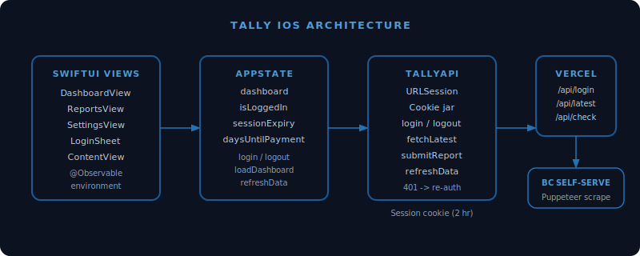

# Tally iOS

iOS companion app for [Tally](https://github.com/nulljosh/tally), the BC benefits tracker.



## Features

- [x] Auth: BC Self-Serve login with 2-hour session management
- [x] Dashboard: payment amount (monospaced), countdown to 25th, status, benefit type
- [x] Messages: inbox from BC Self-Serve
- [x] Reports: view report table data, submit monthly report
- [x] Settings: refresh data (triggers Puppeteer scrape), clear cache, sign out
- [ ] Push notifications for payment dates
- [ ] DTC Navigator integration
- [ ] Offline caching of last-known data

## Stack

- SwiftUI, iOS 17+
- Swift 6, @Observable state management
- URLSession with cookie jar (session cookie auth)
- Backend: `https://tally.heyitsmejosh.com` (Vercel + Puppeteer)

## Architecture

```
SwiftUI Views -> AppState (@Observable) -> TallyAPI (URLSession) -> Vercel Backend -> BC Self-Serve
```

Session cookies are managed automatically by `HTTPCookieStorage.shared`. On 401, AppState sets `showLogin = true` to prompt re-auth.

## Build

```bash
xcodegen generate
open Tally.xcodeproj
```

Requires Xcode 16+ (Swift 6).

## License

MIT 2026, Joshua Trommel
